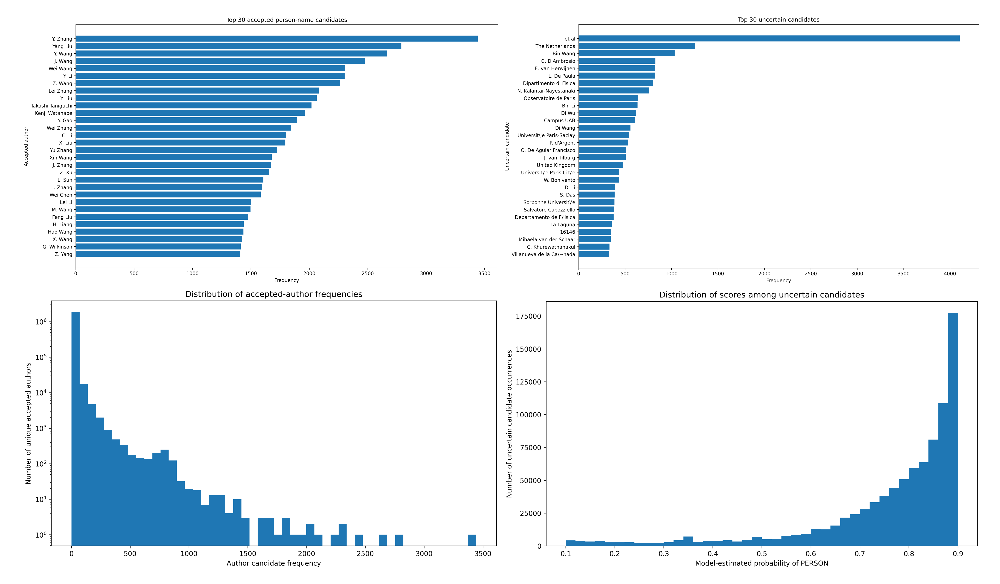
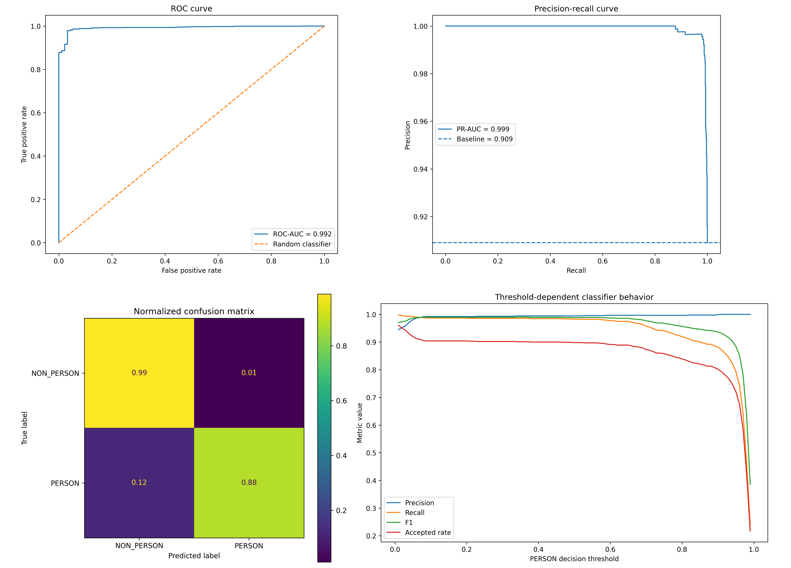
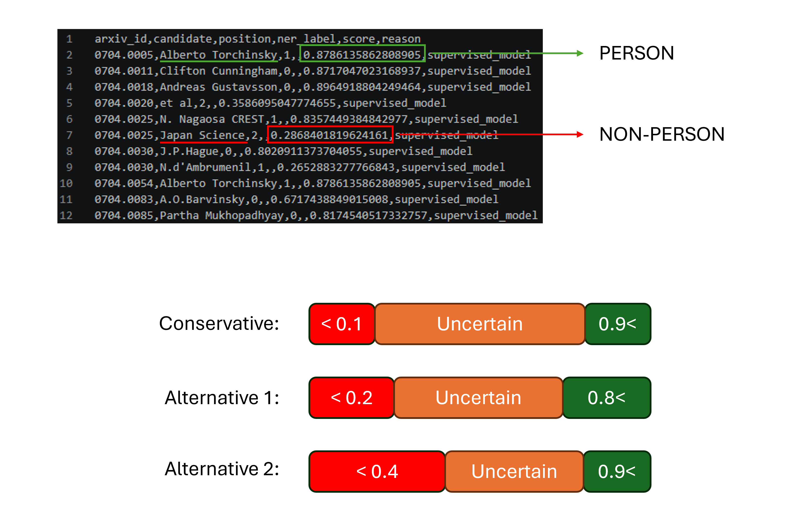

# Author Name Cleaning for arXiv Metadata

This project implements a hybrid data-cleaning pipeline for extracting **person names** from noisy author fields in the arXiv metadata snapshot.

The original problem was that the `authors` field sometimes contains not only real author names, but also affiliations, departments, universities, collaborations, countries, groups, and other non-person entities. Since the dataset contains millions of records, simple manual filtering or stopword-based cleaning is not sufficient.

The goal of this project is to build a scalable and explainable pipeline that keeps only likely **person-name candidates** while filtering out institutional or non-person strings.

---

## Problem

The raw arXiv metadata contains author fields such as:

```text
John Smith, Department of Physics, University of X, Maria Rossi
```

A naive comma-based parser may incorrectly count entries such as:

```text
Department of Physics
University of X
ATLAS Collaboration
Japan Science
et al
```

as if they were author names.

This is problematic for downstream tasks such as:

- author frequency analysis,
- paper recommendation,
- author-based similarity,
- bibliometric analysis,
- graph construction,
- entity resolution.

---

## Approach

I used a hybrid supervised pipeline combining:

1. candidate extraction from the raw author field,
2. structural name features,
3. organization/institutional features,
4. optional NER labels,
5. a supervised binary classifier,
6. threshold-based decision logic.

The classifier estimates:

```text
p(PERSON | candidate)
```

Then candidates are classified as:

```text
p(person) <= nonperson_threshold  -> NON_PERSON
nonperson_threshold < p(person) < person_threshold -> UNCERTAIN
p(person) >= person_threshold -> PERSON
```

For example:



The uncertain category is intentionally preserved. Instead of forcing every ambiguous string into either `PERSON` or `NON_PERSON`, the pipeline keeps a review buffer for borderline cases.

---

## Pipeline Overview

The main processing steps are:

```text
raw arXiv metadata
        |
        v
author-field extraction
        |
        v
candidate splitting
        |
        v
feature extraction
        |
        v
supervised model
        |
        v
PERSON / NON_PERSON / UNCERTAIN
```

The model uses both manually designed features and character-level patterns.

Examples of useful features include:

- token count,
- character length,
- initials,
- title-case patterns,
- organization keywords,
- institutional phrases,
- acronyms,
- particles such as `van`, `de`, `von`,
- punctuation patterns,
- optional NER label,
- character n-gram TF-IDF features.

This makes the method more robust than a pure stopword-based approach.

---

## Main Scripts

### `clean_arxiv_authors.py`

Main cleaning pipeline.

It can be used to:

- run a trial subset,
- export candidates for manual labelling,
- train the supervised classifier,
- run the trained model on the full dataset,
- export accepted and uncertain candidates.

Example trial run:

```powershell
python clean_arxiv_authors.py --file arxiv-metadata-oai-snapshot.json --mode trial --max-records 50000 --model-in author_person_classifier.joblib --output-counts author_counts_model_trial.csv --export-uncertain uncertain_model_trial.csv
```

---

### `evaluate_author_person_model.py`

Evaluates the supervised model using labelled candidates.

It produces:

- ROC curve,
- precision-recall curve,
- confusion matrix,
- normalized confusion matrix,
- threshold-dependent precision/recall/F1 plot,
- error examples,
- prediction table.

Example:

```powershell
python evaluate_author_person_model.py --label-file author_labelling_candidates.csv --model author_person_classifier.joblib --threshold 0.90
```

---

### `visualize_author_cleaning_results.py`

Creates visual summaries of the final cleaning output.

It produces:

- top accepted person-name candidates,
- top uncertain candidates,
- accepted-author frequency distribution,
- uncertain-score distribution,
- decision overview.

Example:

```powershell
python visualize_author_cleaning_results.py --author-counts author_counts_model_trial.csv --uncertain uncertain_model_trial.csv
```

---

### `threshold_sensitivity_uncertain_authors.py`

Runs threshold-sensitivity analysis.

This script applies several threshold pairs to the same fixed test subset and exports the uncertain candidates for each threshold setting.

Example:

```powershell
python threshold_sensitivity_uncertain_authors.py --file arxiv-metadata-oai-snapshot.json --model author_person_classifier.joblib --max-records 50000 --start-record 100000 --output-dir threshold_sensitivity_test_subset
```

Tested threshold pairs include:

```text
0.95 / 0.05
0.90 / 0.10
0.85 / 0.15
0.80 / 0.20
0.75 / 0.25
0.70 / 0.30
```

---

## Model Evaluation

The trained classifier achieved strong discrimination between person and non-person candidates.

The model-level evaluation showed:

- ROC-AUC approximately `0.992`,
- PR-AUC approximately `0.999`,
- very high precision across most threshold values,
- strong separation between person and non-person classes.



The confusion matrix shows that the model performs very well on the labelled evaluation set. The most important error type for this project is the false positive case:

```text
NON_PERSON predicted as PERSON
```

because this means an institution, group, department, or other non-person string enters the cleaned author list.

At the selected operating threshold, the false-positive rate was low, while the model still retained a large proportion of real author names.

The threshold-dependent plot was especially useful because it showed how precision, recall, F1-score, and accepted rate change as the `PERSON` decision threshold changes.

---

## Output-Level Diagnostics

I also inspected the actual output of the pipeline, not only the model metrics.

This is important because a classifier can have high ROC-AUC or PR-AUC but still behave poorly on frequent real-world edge cases.

The output-level diagnostics include:

- top accepted author candidates,
- top uncertain candidates,
- distribution of accepted-author frequencies,
- distribution of scores among uncertain candidates.



The top accepted candidates mostly contain plausible person names such as abbreviated initials and common author-name patterns.

The uncertain list contains a mixture of:

- real but ambiguous author names,
- institutional names,
- countries,
- collaborations,
- malformed candidates,
- strings such as `et al`.

This is expected. The uncertain category is not intended to contain only errors. It is a conservative buffer for candidates where the model score falls between the automatic accept and reject thresholds.

---

## Interpretation of the Uncertain Category

One important observation was that the uncertain list still contained many real author names.

This is not necessarily a problem.

The classifier may correctly rank candidates very well, while the thresholding strategy still sends borderline cases to `UNCERTAIN`.

For example, if the thresholds are:

```text
NON_PERSON <= 0.10
PERSON >= 0.90
```

then any candidate with:

```text
0.10 < p(person) < 0.90
```

is placed in the uncertain bucket.

This means that real but ambiguous names can still appear there, especially:

- short names,
- initials,
- non-Western names,
- names with particles,
- names that resemble institutions,
- rare surnames,
- malformed author strings.

For this project, this behavior is acceptable because the goal is to avoid contaminating the accepted author list with non-person entities.

---

## Why Threshold Sensitivity Matters

I performed threshold-sensitivity analysis because the final decision depends not only on the model score but also on the chosen operating threshold.

A stricter threshold such as:

```text
PERSON >= 0.95
```

gives a cleaner accepted-author list but leaves more real authors in the uncertain bucket.

A looser threshold such as:

```text
PERSON >= 0.70
```

accepts more real authors but may also start admitting more non-person entities.

The threshold-sensitivity analysis helps identify the lowest threshold that still avoids visible leakage of institutions, departments, and collaborations into the accepted author list.

---

## Recommended Validation Strategy

To justify that the cleaning result is reliable, I used or recommend the following checks:

1. **Model-level evaluation**
   - ROC-AUC,
   - PR-AUC,
   - confusion matrix,
   - precision-recall curve.

2. **Threshold analysis**
   - precision, recall, F1-score across thresholds,
   - accepted-rate changes,
   - uncertain-bucket size changes.

3. **Output audit**
   - manually inspect top accepted candidates,
   - manually inspect top uncertain candidates,
   - check whether organizations appear among accepted names.

4. **Error analysis**
   - inspect false positives,
   - inspect false negatives,
   - identify systematic failure modes.

5. **Manual sample audit**
   - randomly sample accepted candidates,
   - manually label them,
   - estimate accepted-output precision.

For this task, the most important metric is not plain accuracy. The most important metric is:

```text
PERSON precision
```

because the main risk is accepting non-person strings as real authors.

---

## Example Workflow

### 1. Export candidates for labelling

```powershell
python clean_arxiv_authors.py --file arxiv-metadata-oai-snapshot.json --mode export-labels --max-records 50000 --label-output author_labelling_candidates.csv --max-label-candidates 5000
```

Then manually fill:

```text
label = 1  for person
label = 0  for non-person
```

---

### 2. Train the classifier

```powershell
python clean_arxiv_authors.py --file arxiv-metadata-oai-snapshot.json --mode train --label-file author_labelling_candidates.csv --model-out author_person_classifier.joblib
```

---

### 3. Run the cleaner on a trial subset

```powershell
python clean_arxiv_authors.py --file arxiv-metadata-oai-snapshot.json --mode trial --max-records 50000 --model-in author_person_classifier.joblib --output-counts author_counts_model_trial.csv --export-uncertain uncertain_model_trial.csv
```

---

### 4. Evaluate the model

```powershell
python evaluate_author_person_model.py --label-file author_labelling_candidates.csv --model author_person_classifier.joblib --threshold 0.90
```

---

### 5. Visualize the output

```powershell
python visualize_author_cleaning_results.py --author-counts author_counts_model_trial.csv --uncertain uncertain_model_trial.csv
```

---

### 6. Run threshold sensitivity

```powershell
python threshold_sensitivity_uncertain_authors.py --file arxiv-metadata-oai-snapshot.json --model author_person_classifier.joblib --max-records 50000 --start-record 100000 --output-dir threshold_sensitivity_test_subset
```

---

## Requirements

Install the core dependencies:

```bash
pip install pandas scikit-learn joblib tqdm matplotlib
```

Optional NER support:

```bash
pip install spacy
python -m spacy download en_core_web_sm
```

---

## Data

This project is designed for the arXiv metadata snapshot:

```text
arxiv-metadata-oai-snapshot.json
```

The dataset is expected to be in JSONL format, where each row is a JSON object containing an `authors` field.

The raw dataset is not included in this repository because of size constraints.

---

## Notes on Reproducibility

The trained model file:

```text
author_person_classifier.joblib
```

depends on custom feature-extraction code from:

```text
clean_arxiv_authors.py
```

Therefore, when loading the model in another script, `clean_arxiv_authors.py` should be available in the same folder.

---

## Limitations

The pipeline is not perfect. Remaining difficult cases include:

- single-token names,
- names that are also institution names,
- collaborations named after people,
- non-Western name formats,
- initials-only candidates,
- malformed author fields,
- country or group names appearing in author positions.

The goal is not to perfectly classify every string automatically. The goal is to create a high-precision accepted author list and isolate ambiguous cases for review.

---

## Summary

This project shows that noisy author metadata can be cleaned effectively using a hybrid supervised approach.

The main conclusion is that a combination of:

```text
rule-based candidate extraction
+ structural features
+ character n-gram features
+ supervised classification
+ conservative thresholding
+ uncertainty analysis
```

is much more robust than simple stopword filtering.

The model achieved very high ROC-AUC and PR-AUC values, and the output-level diagnostics showed that the accepted author list is substantially cleaner than the raw candidate extraction.

The uncertain bucket remains useful as an active-learning and manual-review target.
